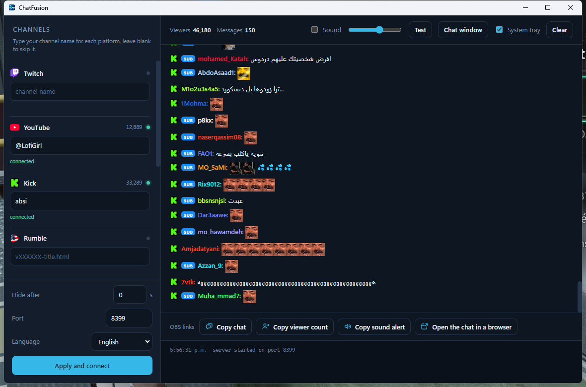

  
  

  One chat from every platform you stream on, in a desktop app and in your OBS overlay.

  <a href="https://github.com/verticalhost/ChatFusion-releases/releases/latest"><strong>Download the latest version</strong></a>

---

  

ChatFusion merges the live chat of eleven streaming platforms into a single stream
of messages. You add the platforms you stream on, type your channel names, and you
get one chat in the app window, chat overlays for OBS, a viewer counter, and alert
cards for follows, subscriptions, gifts, donations and raids.

Reading is anonymous everywhere: no account, no API key, no token. Every connector
uses the public read access each platform already offers to its own web page.

This repository hosts the Windows installers and the update metadata. The source
code is maintained privately.

## Download and install

Pick the file for your system on the
[releases](https://github.com/verticalhost/ChatFusion-releases/releases) page:

| System | File | Then |
| --- | --- | --- |
| Windows 10 and 11 | `ChatFusion-Setup-x.y.z.exe` | Run it. The installer is per user and needs no administrator rights. |
| Linux, any distribution | `ChatFusion-x.y.z-x86_64.AppImage` | Make it executable (`chmod +x`) and run it. No installation. |
| Debian, Ubuntu, Mint | `ChatFusion-x.y.z-amd64.deb` | Install it with `sudo apt install ./ChatFusion-x.y.z-amd64.deb`. |

Then add your platforms, type your channel names, press **Start**, and paste the OBS
links into a browser source. The app opens stopped: nothing connects until you press
Start, and Stop drops every platform at once.

Your channels are saved in your user profile, so an update or a reinstall does not
erase them.

Windows may show a SmartScreen notice the first time, because the installer is not
signed with a commercial certificate. Choose *More info*, then *Run anyway*.

On Linux, the AppImage needs FUSE 2 (`libfuse2`), which most distributions ship;
Ubuntu 22.04 and later may need `sudo apt install libfuse2`.

### Updates

The app updates itself on Windows and with the AppImage. It checks this repository
in the background, downloads a newer version quietly, and then shows a banner in the
window with a single **Restart and install** button. Nothing installs until you
click it. The .deb does not update itself: download the new package and install it
over the old one.

## Supported platforms

| Platform | Chat | Emotes | Viewers |
| --- | --- | --- | --- |
| Twitch | yes | native, plus BetterTTV, FrankerFaceZ and 7TV | yes |
| YouTube Live | yes | yes | yes |
| Kick | yes | yes | yes |
| Rumble | yes | yes | yes |
| VPZONE | yes | yes | yes |
| SharePlay | yes | yes | yes |
| Velora | yes | no | yes |
| Pilled | yes | stickers | yes |
| Blaze | yes | yes | yes |
| Beam | yes | yes | yes |
| WorldsWave | yes | emoji | yes |

Beam relays other platforms into its own room. If you enable Beam together with a
platform it already carries, every message and every alert shows twice.

## Alerts by platform

Platforms don't all share the same events, so an alert only appears where the
platform actually sends it to a viewer without an account.

| Platform | Follows | Subscriptions | Gifted subs and gifts | Donations | Raids |
| --- | --- | --- | --- | --- | --- |
| Twitch | — | yes | yes | Bits | yes |
| YouTube Live | — | memberships | gifted memberships, Jewels | Super Chat, Super Sticker | yes |
| Kick | — | yes | yes | Kicks | yes (hosts) |
| Rumble | — | — | gifted subs | Rants | — |
| VPZONE | yes | yes | yes | Pixels | yes |
| SharePlay | yes | yes | gifted subs, coin gifts | — | yes |
| Velora | yes | yes | yes | Volts | yes |
| Pilled | — | yes | gifts, gifted subs | Goldpills | yes |
| Blaze | yes | yes | gifts | thanks, votes | yes |
| Beam | yes | yes | yes | Embers, tips | yes |
| WorldsWave | yes | — | gifts | tips | — |

A dash means the platform does not give that event to an anonymous viewer:
- Follows on Twitch, Kick and Rumble need the streamer's own login, and YouTube
  never sends new subscribers to the live chat.
- SharePlay tips need a login too.
- Alerts replayed from a platform's history when you press Start are not shown
  again; only what happens live becomes an alert.

## Features

- **One window, every chat.** Platform badge, author colour, role badges, emotes
  and animated GIFs, all merged in the order they arrive.
- **OBS overlays.** A chat overlay and a viewer counter, served as local pages you
  paste straight into a browser source. A copy button for each.
- **Messages that fade.** Set a delay and the overlay drops old messages, while the
  app window keeps the whole history to scroll back through.
- **Alert cards.** One OBS page for follows, subscriptions, gifts, donations and
  raids from every platform, shown one after the other with the platform's logo.
  Five card styles, picked once in Customize and applied to every platform, with a
  switch per kind of alert and a test button to see the card in OBS. Three alert
  sounds to pick from (chime, pop, fanfare), or your own MP3, WAV or OGG file.
- **Sound alert.** A sound on each new message and each alert card, following the
  window's Sound switch and volume. The history replayed on connect stays silent.
- **Only your platforms.** The channel list shows the platforms you use; the others
  wait behind Add a platform, with a search field.
- **Dark and light themes.** Dark by default, light in one click.
- **Chat window.** The overlay in its own window, optionally always on top.
- **System tray.** Closing the window keeps the chat running in the background.
- **Two languages.** French and English, following the language of the computer,
  with a manual override.

## OBS

These pages are served on the port shown in the window, 8357 by default.

| Page | Address |
| --- | --- |
| Chat | `http://localhost:8357/index.html?widget=messages` |
| Horizontal chat | `http://localhost:8357/horizontal.html` |
| Viewer counter | `http://localhost:8357/index.html?widget=states` |
| Alert cards | `http://localhost:8357/alert-cards.html` |

Paste one into an OBS browser source. The copy buttons at the bottom of the window
put them on your clipboard. The alert cards page is transparent: place and resize
the source in OBS, and pick the card style in the window under Customize. The
older sound-only page, `alerts.html`, is still served for existing scenes.

## Show it in Discord

Discord can tell your friends you are running ChatFusion while you stream.
Nothing needs setting up in the program: this is Discord's own detection of
what is running. In Discord, open Settings, find Registered Games under the
activity settings, choose **Add it!** and pick ChatFusion from the list of
running programs. Your activity then reads *Playing ChatFusion*.

## How it works

A small local server merges every connector into one stream and publishes it over
a WebSocket. The window and the OBS pages are both clients of that server, which
is why they always show the same chat.

Each connector turns its platform's own format into a shared message model: an
author with a colour, an avatar and role badges, then a list of contents that are
text, images, emotes or links.

## Troubleshooting

- **The window says the port is already in use.** Another program listens on
  8357. Change the port in the window; the OBS links follow the new port.
- **A platform stays on "connecting".** Check the channel name: Twitch and
  SharePlay want the channel name, YouTube wants a handle or channel ID, Rumble
  wants the video page name, the others want the channel slug from the address
  bar.
- **The chat is empty.** Check that you pressed *Start*. Messages appear as
  viewers write them; use the *Test* button to check the sound.
- **No alert shows in OBS.** Alerts only come from live events, and not every
  platform sends every kind (see the table above). Open Customize and press
  *Test an alert*: the card appears in OBS if the page is set up.

## Notes

Each platform is labelled with its own site icon, used only to say which service
a message came from. Those marks belong to their owners.

## Licence

Proprietary. All rights reserved. The source code is not open; the compiled
application is distributed for personal use.

---

  Made by <a href="https://vpzone.tv"><strong>VPZONE.TV</strong></a>

